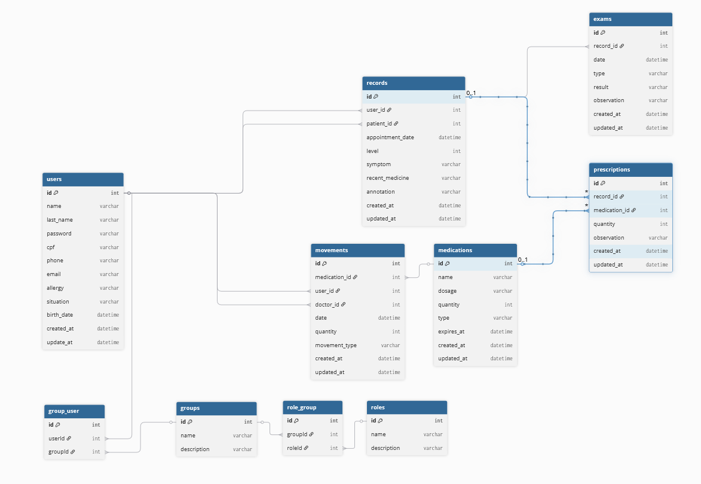

# Título do Projeto

## TI-43


## Integrantes
- Eduardo Bruno Coppi
- Eduardo Lombardo Fuzato
- Rafael Eugênio Crempe
- Sara Malavazi

## Tecnologias Utilizadas:

- Next.js
- Express
- Prisma
- TypeScript
- React
- Bootstrap

## Instalação e Execução: 

npx prisma generate

npx prisma migrate dev --name init

npx prisma migrate dev --name nome_atualizaçao

npx prisma db push --force-reset

npm run seed

## Modelagem da API



# Endpoints da API

## Medication


### 1.1 - Criar Medicamento /POST
Cadastra um novo medicamento no sistema

### Requisição

**Query:** nenhum

**Cabeçalho:** 

         Content-Type: application/json

    Authorization: Bearer {{token}}

Body: 

```
{
     "name": string com o nome do medicamento,
     "quantity": quantidade em número do medicamento a ser cadastrado,
     "dosage": string com a dosagem do medicamento a ser cadastrado,
     "type": string com o tipo do medicamento a ser cadastrado,
     "expiresAt": data de vencimento do medicamento em ISO 
}
```

### Resposta

#### Status Code:

- **201**: Sucesso no cadastrado
- **400**: Preencha todos os campos
- **409**: Medicamento já cadastrado

**Cabeçalho:**

**Body:** nenhum


### 1.2.1 - Listar todos os medicamentos /GET
Retorna a lista de todos os medicamentos cadastrados no sistema

### Requisição

**Query:** nenhum

**Cabeçalho:**

    Content-Type: application/json

    Authorization: Bearer {{token}}

**Body:** nenhum

### Resposta

#### Status Code:

- **200**: Sucesso na requisição
- **401**: Token de autenticação inválido ou ausente
- **500**:  Erro interno no servidor

**Cabeçalho:**

Content-Type: application/json

**Body:**

```
[
  {
    "id": número identificador do medicamento,
    "name": string com nome do medicamento,
    "quantity": number com a quantidade disponível,
    "dosage": string com a dosagem do medicamento,
    "type": string com o tipo do medicamento,
    "expiresAt": data de vencimento no formato ISO,
    "createdAt": data de criação no formato ISO,
    "updatedAt": data da última atualização no formato ISO
  },
  ...
]
```

### 1.2.2 - Buscar medicamentos por nome, dosagem ou tipo /GET
Busca medicamentos no sistema com base nos parâmetros de filtro opcionais: nome, tipo e dosagem.

### Requisição


**Query:**

    name: string nome do medicamento buscado
    type: string com o tipo do medicamento buscado
    dosage: string com a dosagem do medicamento buscado

**Cabeçalho:**

    Content-Type: application/json
    Authorization: Bearer {{token}}


**Body:** nenhum

### Resposta

#### Status Code:

- **200**: Lista de medicamentos retornada com sucesso
- **400**: Parâmetros inválidos na requisição
- **401**: Token inválido ou ausente
- **500**: Erro interno no servidor

**Cabeçalho:**

    Content-Type: application/json


**Body:**

```json
[
  {
    "id": 1,
    "name": "Paracetamol",
    "tipo": "Analgésico",
    "dosagem": "500mg",
    "quantidade": 300
  },
  {
    "id": 2,
    "name": "Ibuprofeno",
    "tipo": "Anti-inflamatório",
    "dosagem": "400mg",
    "quantidade": 150
  }
]
```


### 1.3 - Atualizar medicamento /PUT
Atualiza os dados de um medicamento existente com base no seu nome.

### Requisição

**Query:**

    name: string nome do medicamento a ser atualizado 


**Cabeçalho:**

Content-Type: application/json
Authorization: Bearer {{token}}


**Body:**

```json
{
    "name": "Paracetamol",
    "quantity": 300
}

```

### Resposta

#### Status Code:

- **200**: Medicamento atualizado com sucesso
- **400**: Dados inválidos na requisição
- **401**: Token inválido ou ausente
- **404**: Medicamento não encontrado
- **500**: Erro interno no servidor

**Cabeçalho:**

    Content-Type: application/json

**Body:**
```
{
    "message": "Medicamento atualizado com sucesso"
}
```
### 1.4 - Deletar Medicamento /DELETE

Remove um medicamento do sistema com base no seu ID

### Requisição

**Query:** 

    id: identificador numérico do medicamento a ser deletado

**Cabeçalho:**

    Content-Type: application/json

    Authorization: Bearer {{token}}


**Body:** nenhum

### Resposta
#### Status Code:

- **200**: Medicamento deletado com sucesso
- **401**: Token inválido ou ausente
- **404**: Medicamento não encontrado
- **500**: Erro interno no servidor

**Cabeçalho:**

    Content-Type: application/json

**Body:** nenhum


## Record

### 1 - Criar Record /POST  
Cria um novo registro de atendimento/sintoma para um paciente.

### Requisição

**Query:** nenhum

**Cabeçalho:**  

     Content-Type: application/json  
     Authorization: Bearer {{token}}

Body:  


### Resposta

201: Registro criado com sucesso  
404: Paciente ou usuário não encontrado  
401: Não autorizado (token ausente ou inválido)  
500: Erro interno no servidor  


---

### Resposta

#### Status Code:

- **201**: Registro criado com sucesso  
- **400**: Campos obrigatórios não preenchidos ou dados inválidos  
- **401**: Não autorizado (token ausente ou inválido)  
- **404**: Paciente ou usuário não encontrado  
- **500**: Erro interno no servidor  

**Cabeçalho:**  

**Body:** nenhum

---

### 2 - Listar Todos os Records /GET

### Requisição

**Query:** nenhum obrigatório, pode usar filtro por `patientId` ou `appointmentDate`

**Cabeçalho:**  

     Content-Type: application/json  
     Authorization: Bearer {{token}}

GET https://projeto-integrador-lf6v.onrender.com/records?patientId=1 HTTP/1.1

### Resposta

#### Status Code:

- **200**: Lista de registros retornada com sucesso  
- **401**: Não autorizado  

**Cabeçalho:**  

**Body:** lista JSON dos records

---

### 3 - Buscar Record por ID /GET

### Requisição

**Query:** nenhum

**Cabeçalho:**  

     Content-Type: application/json  
     Authorization: Bearer {{token}}

GET https://projeto-integrador-lf6v.onrender.com/records/1 HTTP/1.1

### Resposta

#### Status Code:

- **200**: Registro retornado com sucesso  
- **401**: Não autorizado  
- **404**: Registro não encontrado  

**Cabeçalho:**  

**Body:** JSON do record

---

### 4 - Atualizar um Record /PUT

### Requisição

**Query:** nenhum

**Cabeçalho:**  

     Content-Type: application/json  
     Authorization: Bearer {{token}}

Body:

{
"appointmentDate": string com a nova data em ISO
}


### Resposta

#### Status Code:

- **200**: Registro atualizado com sucesso  
- **400**: Dados inválidos  
- **401**: Não autorizado  
- **404**: Registro não encontrado  

**Cabeçalho:**  

**Body:** JSON do record atualizado

---

### 5 - Deletar um Record /DELETE

### Requisição

**Query:** nenhum

**Cabeçalho:**  

     Content-Type: application/json  
     Authorization: Bearer {{token}}

DELETE https://projeto-integrador-lf6v.onrender.com/records/2 HTTP/1.1

### Resposta

#### Status Code:

- **200**: Registro deletado com sucesso  
- **401**: Não autorizado  
- **404**: Registro não encontrado  

**Cabeçalho:**  

**Body:** JSON do record deletado

## Exam

### 1 - Criar Exame /POST  
Cria um novo exame vinculado a um registro (record).

### Requisição

**Query:** nenhum

**Cabeçalho:**  

     Content-Type: application/json  
     Authorization: Bearer {{token}}

Body:

{
"recordId": 1,
"date": "2025-09-04T19:51:38.868Z",
"type": "raio-x",
"result": "perna quebrada",
"observation": "precisa de remedio"
}

markdown
Copiar código

### Resposta

#### Status Code:

- **201**: Exame criado com sucesso  
- **400**: Campos obrigatórios não preenchidos ou dados inválidos  
- **401**: Não autorizado (token ausente ou inválido)  
- **404**: Registro (record) não encontrado  
- **500**: Erro interno no servidor  

**Cabeçalho:**  

**Body:** nenhum

---

### 2 - Listar Exames /GET

### Requisição

**Query:** pode filtrar por `recordId`, `date`, `type`, `result`, `observation`

**Cabeçalho:**  

     Content-Type: application/json  
     Authorization: Bearer {{token}}

Exemplo:

GET https://projeto-integrador-lf6v.onrender.com/exams?recordId=1 HTTP/1.1

yaml
Copiar código

### Resposta

#### Status Code:

- **200**: Lista de exames retornada com sucesso  
- **401**: Não autorizado  

**Cabeçalho:**  

**Body:** lista JSON dos exames


## Presrição

### 1.1 - Criar Prescrição 
Cadastra uma nova prescriçaõ no sistema

### Rota
Post /prescription

### Requisição

**Query:** nenhum parâmetro

**Cabeçalho:** 

     Content-Type: application/json

     Authorization: Bearer {{token}}

Body: 

```
{
    "recordId": 2,
    "medicationId":1,
    "quantity":10,
    "observation": "Paciente em estado vegetativel"
}
```

### Resposta

#### Status Code:

- **201**: Sucesso no cadastrado
- **400**: Falha no cadastro por dados incompletos
- **401**: Token ausente ou inválido
- **500**: erro interno do servidor

**Cabeçalho:**
     Nenhum

**Body:** 

```
{
     "id": 123,
     "message": "Prescrição criada com sucesso" 
}
```


npm install bcrypt express-session nodemailer uuid             (faz a criptografia da senha)
npm install jsonwebtoken

